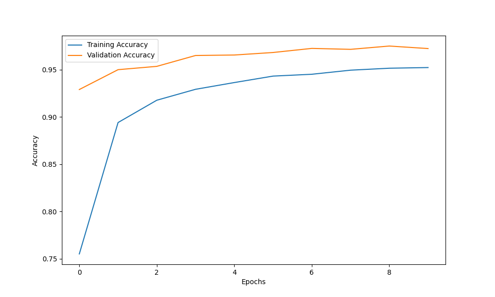
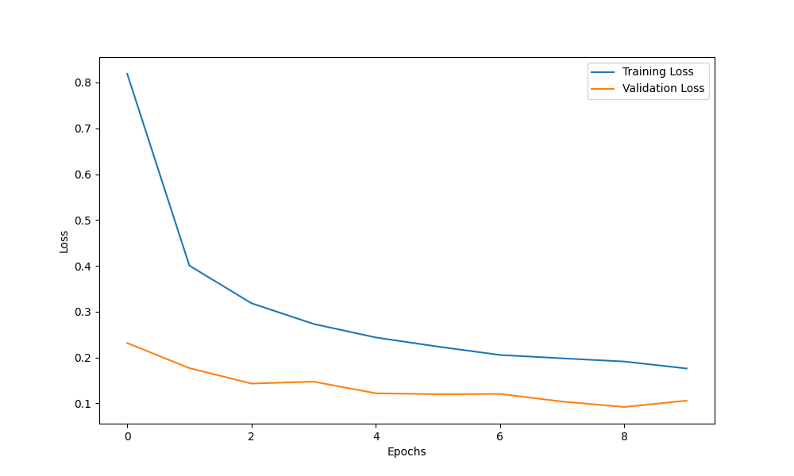
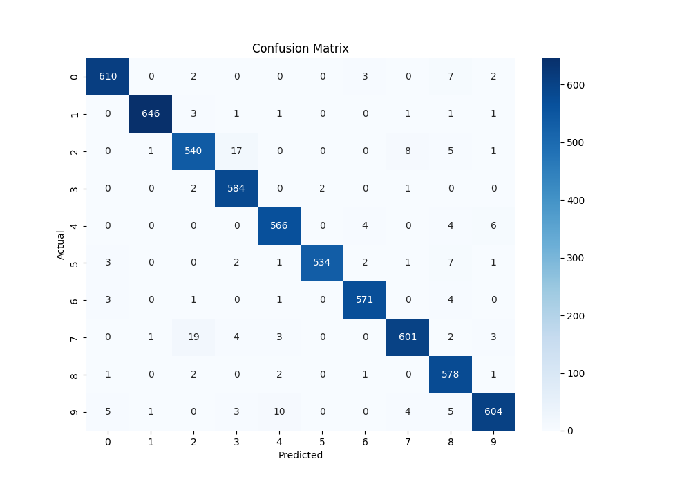
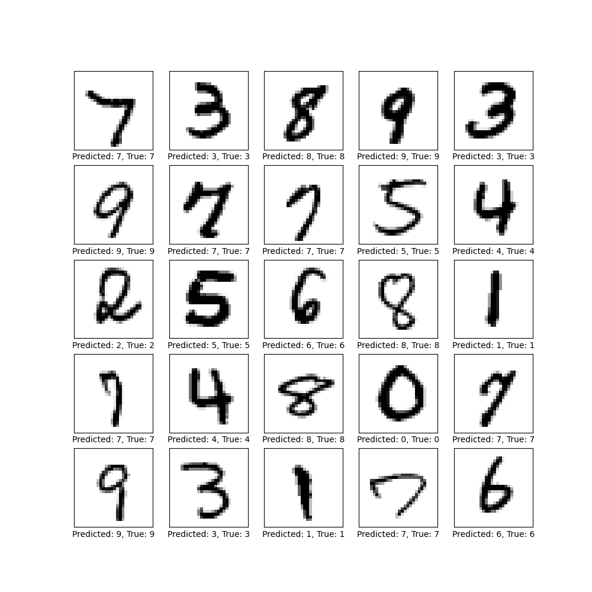
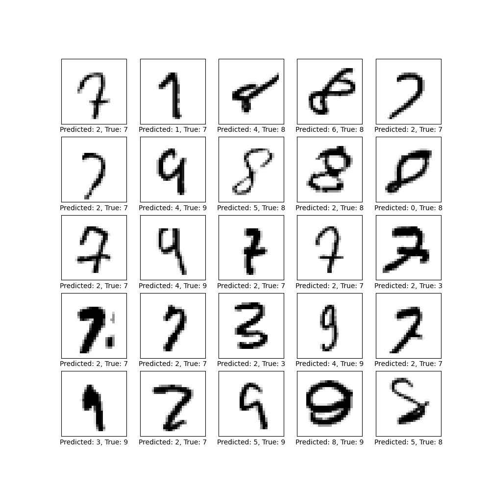

# MNIST Digit Prediction

## Overview
This project implements a Convolutional Neural Network (CNN) to predict handwritten digits from the MNIST dataset. The model is trained on a portion of the dataset and evaluated on a separate validation set. It utilizes data augmentation to improve model performance and generate various evaluation metrics, including accuracy, precision, recall, F1-score, and ROC AUC.

## Table of Contents
- [MNIST Digit Prediction](#mnist-digit-prediction)
  - [Overview](#overview)
  - [Table of Contents](#table-of-contents)
  - [Technologies Used](#technologies-used)
  - [Dataset](#dataset)
  - [Training the Model](#training-the-model)
  - [Evaluation](#evaluation)
  - [Results](#results)
    - [Accuracy](#accuracy)
    - [Loss](#loss)
    - [Confusion Matrix](#confusion-matrix)
    - [Sample Predictions](#sample-predictions)
    - [Incorrect Predictions](#incorrect-predictions)
  - [Contributing](#contributing)
  - [License](#license)

## Technologies Used
- Python 3.x
- TensorFlow
- Keras
- NumPy
- Pandas
- Matplotlib
- Seaborn
- Scikit-learn

## Dataset
The MNIST dataset consists of 70,000 images of handwritten digits (0-9) and is commonly used for training various image processing systems. In this project, the dataset is split into training (60,000 images) and validation (10,000 images) sets.

## Training the Model
The CNN model consists of the following layers:
- Three convolutional layers followed by max pooling layers.
- A flatten layer to convert the 2D matrix into a 1D vector.
- A dense layer with 128 neurons and ReLU activation.
- A dropout layer to reduce overfitting.
- An output layer with softmax activation for multi-class classification.

The model is trained using the Adam optimizer and categorical cross-entropy loss.

## Evaluation
After training, the model's performance is evaluated using:
- **Confusion Matrix**: Visualizes the classification results.
- **Classification Report**: Displays precision, recall, F1-score, and accuracy.
- **ROC AUC Score**: Measures the model's ability to distinguish between classes.
- Various plots, including the first 25 validation images, incorrectly classified images, and the confusion matrix.

## Results
The evaluation metrics are saved in `metrics.json`, and plots are generated and saved in the `./plots` directory.

### Accuracy

### Loss

### Confusion Matrix

### Sample Predictions

### Incorrect Predictions

## Contributing
Contributions are welcome! If you have suggestions for improvements or new features, please create an issue or submit a pull request.

## License
This project is licensed under the MIT License. See the [LICENSE](LICENSE) file for details.
