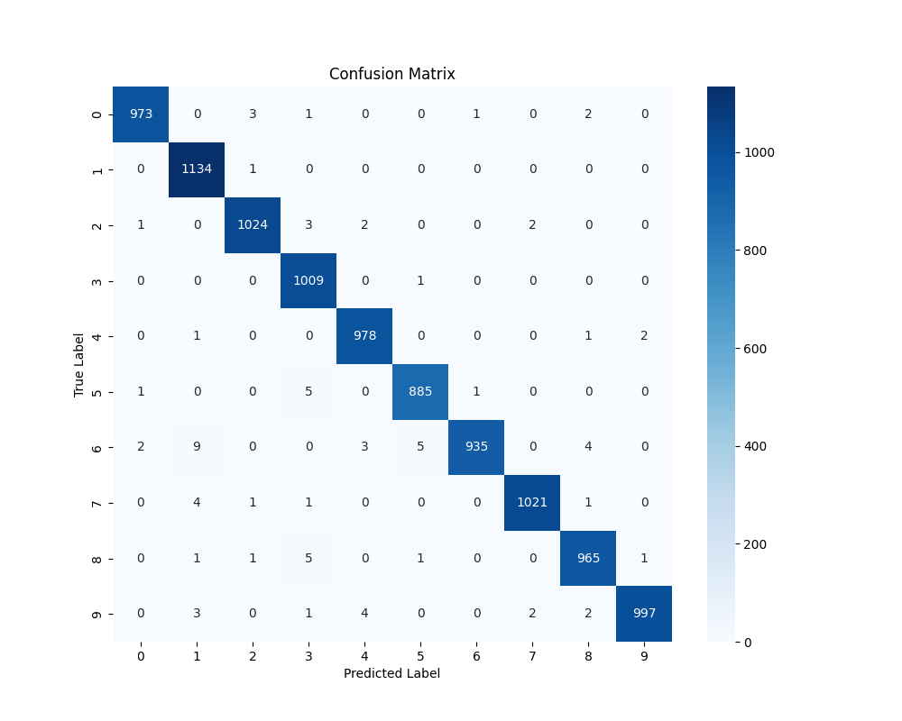
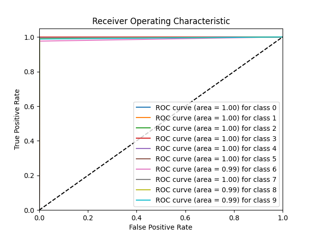
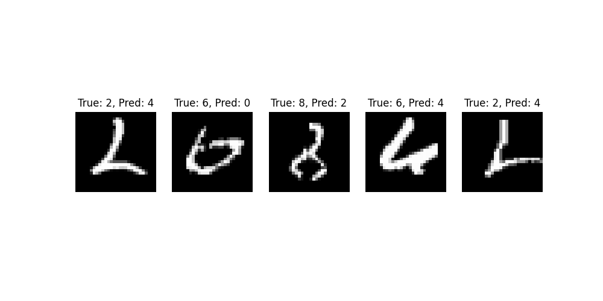

# MNIST Digit Classification using Convolutional Neural Networks (CNN)

This project implements a Convolutional Neural Network (CNN) to classify handwritten digits from the MNIST dataset. The model uses data augmentation for improved generalization and GPU support for enhanced performance.

## Table of Contents

- [Installation](#installation)
- [Usage](#usage)
- [Data Augmentation](#data-augmentation)
- [Model Saving](#model-saving)
- [Training](#training)
- [Evaluation](#evaluation)
- [Results](#results)
- [License](#license)

## Demo


## Installation

To get started, ensure you have Python and pip installed. You can then install the required packages with:

```bash
pip install torch torchvision matplotlib scikit-learn seaborn
```

## Usage

1. Clone the repository:

    ```bash
    git clone https://github.com/driessenslucas/numbers_mnist
    cd numbers_mnist
    ```

2. Run the training script:

    ```bash
    python train.py
    ```

   This will download the MNIST dataset, apply data augmentation, and train the CNN model.

## Data Augmentation

The project includes data augmentation techniques to improve model generalization, including:

- **Random Rotation**: Images are randomly rotated by up to 10 degrees.
- **Random Affine Transformation**: Images are randomly translated by up to 10% of the image dimensions.

## Model Saving

During training, the model saves the best-performing version based on validation accuracy to a file named `best_model.pth`.

## Training

The model is trained for 10 epochs. Training uses the Adam optimizer with a learning rate of 0.001 and a batch size of 64. Validation is done after each epoch to monitor performance and save the best model.

## Evaluation

To evaluate the trained model, run the following command:

```bash
python evaluate.py
```

This will load the best model, compute accuracy, AUC-ROC, confusion matrix, and display images of wrongly predicted digits.

### Evaluation Outputs

1. **Accuracy**: The overall accuracy of the model on the test dataset.
2. **Classification Report**: Precision, recall, and F1-score for each digit class.
3. **Confusion Matrix**: Visual representation of true vs. predicted classes.
   
4. **AUC-ROC Curve**: ROC curve for each digit class, showing the AUC score for each.
   
5. **Wrong Predictions**: Sample images where the model made incorrect predictions.
   

## Results

The model achieves a high accuracy of **91.21%** on the test dataset, with AUC-ROC values close to 1 for most classes, indicating strong performance.

## License

This project is licensed under the MIT License. See the [LICENSE](LICENSE) file for details.
